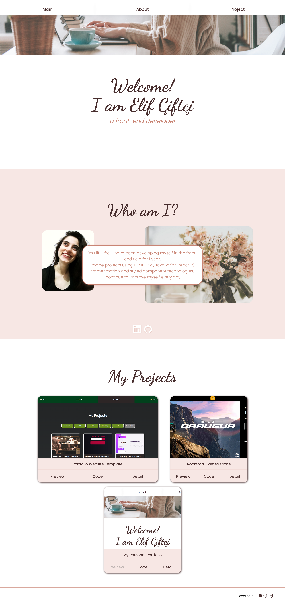

# Personal Portfolio

My personal website

This project was bootstrapped with [Create React App](https://github.com/facebook/create-react-app).

## Used Technologies:

- React
- Styled Component
- Framer-motion

## Available Scripts

In the project directory, you can run:

## How to Install and Run the Project

1. **Clone** the project
2. **Run** npm install
3. **Run** npm start

**Not:** The project run "http://localhost:3000"

## What does the project look like?

- To see the project click [here](https://elifciftci.netlify.app/)

